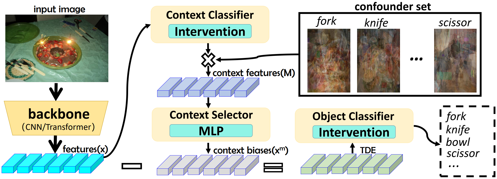
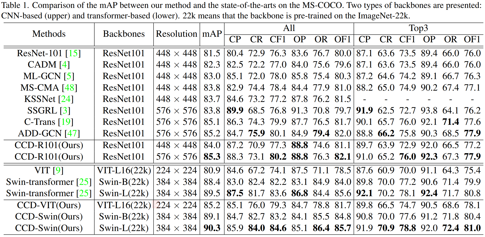

# Introdunction
Unofficial PyTorch  implementation of the paper ["Contextual Debiasing for Visual Recognition with Causal Mechanisms"](https://openaccess.thecvf.com/content/CVPR2022/papers/Liu_Contextual_Debiasing_for_Visual_Recognition_With_Causal_Mechanisms_CVPR_2022_paper.pdf)

## Abstract
<center> As a common problem in the visual world, contextual bias means the recognition may depend on the cooccurrence context rather than the objects themselves, which is even more severe in multi-label tasks due to multiple targets and the absence of location. Although some studies have focused on tackling the problem, removing the negative effect of context is still challenging because it is difficult to obtain the representation of contextual bias. In this paper, we propose a simple but effective framework employing causal inference to mitigate contextual bias. We first present a Structural Causal Model (SCM) clarifying the causal relation among object representations, context, and predictions. Then, we develop a novel Causal Context Debiasing (CCD) Module to pursue the direct effect of an instance. Specifically, we adopt causal intervention to eliminate the effect of confounder and counterfactual reasoning to obtain a Total Direct Effect (TDE) free from the contextual bias. Note that our CCD framework is orthogonal to existing statistical models and thus can be migrated to any other backbones. Extensive experiments on several multilabel classification datasets demonstrate the superiority of our model over other state-of-the-art baselines </center>

## Architecture
Overview of the proposed model. The model is composed of two modules: the intervention (interventional classifier) and the counterfactual (elimination of context bias).


## Results on MS-COCO:



# BibTex
```
@InProceedings{Liu_2022_CVPR,
    author    = {Liu, Ruyang and Liu, Hao and Li, Ge and Hou, Haodi and Yu, TingHao and Yang, Tao},
    title     = {Contextual Debiasing for Visual Recognition With Causal Mechanisms},
    booktitle = {Proceedings of the IEEE/CVF Conference on Computer Vision and Pattern Recognition (CVPR)},
    month     = {June},
    year      = {2022},
    pages     = {12755-12765}
}
